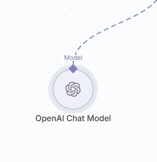
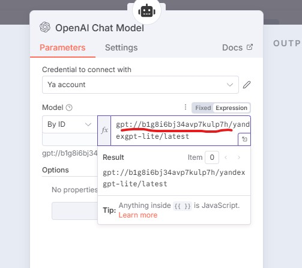
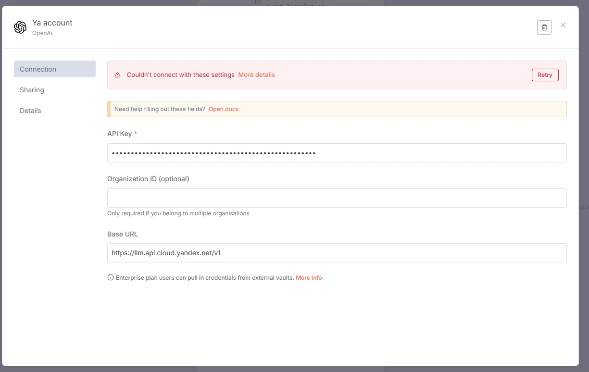

# Автоматизация бизнес приложений с LLM

## Описание RAG Simple Vector Store с AI Agent (Ollama)

В проекте реализован простой RAG (Retrieval-Augmented Generation) pipeline с использованием векторного хранилища и AI-агента на базе Ollama.  
Документы индексируются с помощью эмбеддингов, полученных через Ollama (`nomic-embed-text`).  
AI-агент ищет релевантные документы по запросу пользователя, извлекает их из векторного хранилища и генерирует ответ с учетом найденной информации.

**Основные компоненты:**
- Векторное хранилище для поиска по эмбеддингам.
- Ollama для генерации эмбеддингов и ответов.
- Интеграция с n8n для автоматизации бизнес-процессов.

## Установка 

Установите node.js с официального сайта https://nodejs.org/en/download .   

Клонируйте проект, откройте папку в VsCode.  

В терминале установите зависимости командой:  

```
npm i
```

## Запуск
Для запуска n8n в консоли введите
```
npx n8n
```

Загрузите модель эмбеддингов в другом терминале: 
```
ollama pull nomic-embed-text
```

Документ с фиктивными ценами на телефоны хранится в файле `rag_data/test.json`  


Процесс создания n8n workflow будет рассмотрен на практическом занятии. 

## Настройка Yandex OpenAI Chat

### 1. Дважды кликните на узле OpenAI Chat



### 2. Переключите выбор модели в режим Expression и введите ID модели, например `gpt://b1g8i6bj34avp7kulp7h/yandexgpt-lite/latest`



Обратите внимание, нужно вместо `b1g8i6bj34avp7kulp7h` подставить свой FOLDER_ID!!!

### 3. Нажмите на карандашик в разделе Credentials и в новом меню введите свой YA_API_KEY



### 4. Также не забудьте указать Base URL: `https://llm.api.cloud.yandex.net/v1`  

Не обращайте внимание на сообщение об ошибке, закройте настройки и протестируйте агента.  

