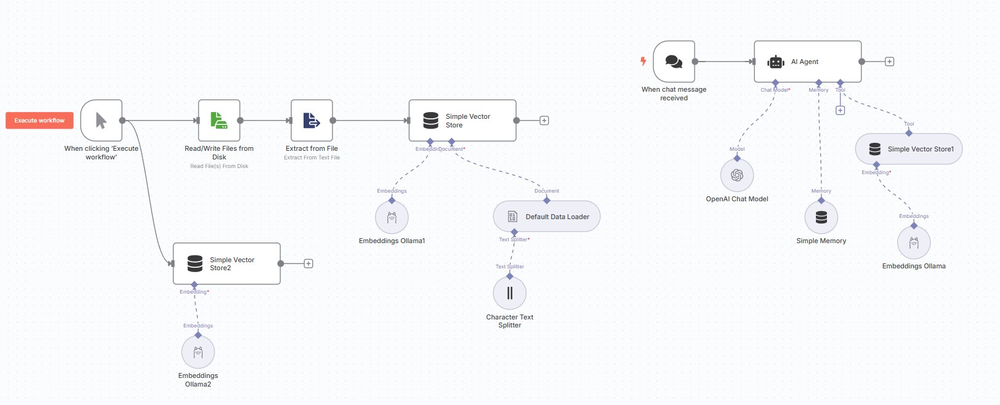

# Автоматизация бизнес приложений с LLM

## Описание RAG Simple Vector Store с AI Agent (Ollama)

В проекте реализован простой RAG (Retrieval-Augmented Generation) pipeline с использованием векторного хранилища и AI-агента на базе Ollama.  
Документы индексируются с помощью эмбеддингов, полученных через Ollama (`nomic-embed-text`).  
AI-агент ищет релевантные документы по запросу пользователя, извлекает их из векторного хранилища и генерирует ответ с учетом найденной информации.

**Основные компоненты:**
- Векторное хранилище для поиска по эмбеддингам.
- Ollama для генерации эмбеддингов и ответов.
- Интеграция с n8n для автоматизации бизнес-процессов.

## Установка 

Установите node.js с официального сайта https://nodejs.org/en/download .   


Клонируйте проект, откройте папку и в терминале установите зависимости командой:  

```
npm i
```

## Запуск
Для запуска n8n в консоли введите
```
npx n8n
```

Для запуска ollama, скачанной с github нужно запустить сервер из папки, где она установлена:  
```
./ollama serve
```

Загрузите модель эмбеддингов в другом терминале: 
```
ollama pull nomic-embed-text
```

Документ с фиктивными ценами на телефоны хранится в файле `rag_data/test.json`  



Процесс создания n8n workflow будет рассмотрен на практическом занятии. 
